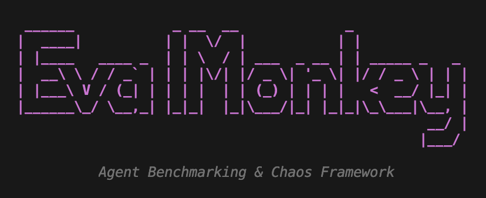

<p align="center">
  
</p>

# EvalMonkey

<p align="center">
  <b>Agent Benchmarking & Chaos Engineering Framework</b><br>
  <i>"Don't just trust your agent. Prove it works. Then break it."</i>
</p>

<p align="center">
  
</p>


## Overview
Agents are fundamentally non-deterministic. They rely on external APIs, tool loops, and massive context windows.
**EvalMonkey** is the ultimate, strictly local, open-source execution harness that enables developers to:
1. 🎯 **Benchmark Capabilities**: Run standard Agent benchmark datasets against your agent endpoints natively!
2. 🔥 **Inject Chaos**: Mutate headers, spike latency, and corrupt schemas dynamically to prove true resilience.
3. 📈 **Track Production Reliability**: Locally store all scores to visualize a single Production Reliability metric that aggregates capability plus chaos-resilience over time!

EvalMonkey natively supports evaluating ANY LLM: **AWS Bedrock**, **Azure**, **GCP**, **OpenAI**, and **Ollama**.

> **Note on API Keys:** If you have special setups that generate long-lived, static API keys for Bedrock, Azure, or GCP, simply supply them in the `.env`! EvalMonkey seamlessly supports both standard IAM / Service Account credential flows *and* long-term stateless authentication strings.

## ⚡️ Quick Start

```bash
git clone https://github.com/Corbell-AI/evalmonkey
cd evalmonkey
pip install -e .
```

**Step 1 — Run this once inside your agent's project folder:**
```bash
cd /your/crewai-project       # wherever your agent lives
evalmonkey init --framework crewai --name "My Research Crew" --port 8000
```
This auto-generates a pre-filled `evalmonkey.yaml` with the correct request/response format for your framework. Supported: `crewai`, `langchain`, `openai`, `bedrock`, `autogen`, `ollama`, `strands`, `custom`.

**Step 2 — Edit the two settings that matter:**
```yaml
# evalmonkey.yaml — generated for CrewAI
agent:
  name: "My Research Crew"
  framework: crewai
  url: http://localhost:8000/chat       # ← where your agent listens
  request_key: message
  response_path: reply

  # ← EvalMonkey will start this for you automatically!
  # It spawns the process, waits for it to turn on, benchmarks, then stops it.
  agent_command: "python src/agent.py"  # or: uvicorn src.agent:app --port 8000
  agent_startup_wait: 3                 # seconds to wait after launch

eval_model: "gpt-4o"   # ← the LLM used as benchmark judge
```

**Step 3 — Run everything. EvalMonkey starts your agent, benchmarks it, then stops it:**
```bash
evalmonkey run-benchmark --scenario mmlu
evalmonkey run-chaos --scenario mmlu --chaos-profile client_prompt_injection
evalmonkey history --scenario mmlu
```

> EvalMonkey discovers `evalmonkey.yaml` from the **current working directory** — the same convention used by `pytest`, `promptfoo`, and `docker-compose`. Run all commands from your agent's project folder.


## 🤝 Works With Any Agent — No Code Changes Required

EvalMonkey talks to your agent over plain HTTP. As long as your agent is running and has an endpoint URL, you're done. That's it.

```bash
# Point EvalMonkey at your existing running agent
evalmonkey run-benchmark --scenario mmlu --target-url http://localhost:8000/chat
```

**Your agent returns a different JSON format?** Use two flags to map any request/response shape:

| Flag | What it does | Example |
|---|---|---|
| `--request-key` | Which key to send the question under | `message`, `prompt`, `input` |
| `--response-path` | Dot-path to extract the answer from | `output.text`, `choices.0.message.content`, `result` |

```bash
# CrewAI agent that takes {"message":""} and returns {"reply":""}
evalmonkey run-benchmark --scenario mmlu \
  --target-url http://localhost:8000/chat \
  --request-key message \
  --response-path reply

# OpenAI-compatible endpoint returning {"choices":[{"message":{"content":""}}]}
evalmonkey run-benchmark --scenario arc \
  --target-url http://localhost:8000/v1/chat/completions \
  --request-key content \
  --response-path choices.0.message.content
```

### Supported Frameworks

| Framework | Notes |
|---|---|
| 🦜 **LangChain** | Any Chain, LCEL pipe, or AgentExecutor behind FastAPI |
| 🤖 **CrewAI** | Any Crew behind a `/chat` or custom endpoint |
| ✨ **OpenAI Agents SDK** | Native OpenAI Chat Completions format supported via `--response-path` |
| ☁️ **AWS Bedrock / Agent Core** | Any Bedrock endpoint, IAM or long-lived key |
| 🧩 **Microsoft AutoGen** | Any ConversableAgent behind HTTP |
| 🦙 **Ollama** | Running locally at `http://localhost:11434` |
| 🧵 **Strands SDK** | Built-in sample apps included |
| 🌐 **Any HTTP Agent** | Flask, Express.js, Go — if it accepts POST it works |

<details>
<summary>📦 Don't have an HTTP endpoint yet? Use our ready-made thin adapters (click to expand)</summary>

Copy the relevant file from `apps/framework_adapters/` next to your agent code, swap in your Crew/Chain/Agent, and run it. No changes needed to EvalMonkey.

- `langchain_adapter.py` — wraps any LangChain chain  
- `crewai_adapter.py` — wraps any CrewAI Crew  
- `openai_agents_adapter.py` — wraps OpenAI Agents SDK  
- `bedrock_agentcore_adapter.py` — wraps AWS Bedrock Converse API  
- `autogen_adapter.py` — wraps Microsoft AutoGen Crew  

Each adapter is ~40 lines and exposes a `/solve` endpoint on `localhost`.

</details>

---


## 🌍 Supported Standard Benchmarks
EvalMonkey natively supports **10** off-the-shelf benchmark datasets pulled directly from HuggingFace. List them anytime via the CLI:
```bash
evalmonkey list-benchmarks
```
| Scenario ID | Description |
|---|---|
| `gsm8k` | Grade School Math word problems focusing on multi-step reasoning capabilities. |
| `xlam` | XLAM Function Calling 60k: Tests agent tool execution logic and parameter structuring. |
| `swe-bench` | SWE-Bench: Resolving real-world GitHub issues for coding agents. |
| `gaia-benchmark` | GAIA: General AI Assistants testing on real-world web/tool multi-step tasks. |
| `webarena` | WebArena: Highly interactive computer usage and browser manipulation. |
| `human-eval` | HumanEval: Fundamental Python code generation from docstrings. |
| `mmlu` | Massive Multitask Language Understanding: Broad generalized knowledge across 57 subjects. |
| `arc` | AI2 Reasoning Challenge: Complex grade-school science questions. |
| `truthfulqa` | TruthfulQA: Tests whether an agent mimics human falsehoods or hallucination. |
| `hella-swag` | HellaSwag: Commonsense natural language inferences. |

---

## 🛠️ Experiences 

### Experience 1: Local Sample Agents (Single Command Start)
**Easiest Experience**: Test our built-in sample agents with a single command! EvalMonkey will spawn the sample agent in the background automatically and run the benchmark.
```bash
# Run against just the first 5 records
evalmonkey run-benchmark --scenario gsm8k --sample-agent rag_app

# Run a statistically robust test against 50 different records!
evalmonkey run-benchmark --scenario gsm8k --sample-agent rag_app --limit 50
```

**Metrics Output:**
```
╭──────────────────────────────────────────────────────────╮
│ Benchmark Results                                        │
│ ──────────────────────────────────────────────────────── │
│ Scenario  gsm8k                                          │
│ Score     90/100 (Diff: +5)                              │
│ Previous  85/100                                         │
│ Reasoning Agent correctly utilized calculator for ...    │
╰──────────────────────────────────────────────────────────╯
```

### Experience 2: Benchmarking Your Custom Local Agents
Provide your own API target!
```bash
evalmonkey run-benchmark --scenario mmlu --target-url http://localhost:8000/my-custom-agent
```

### 💡 Why Chaos Benchmark Your Agents?
Resiliency and Reliability are arguably the most crucial components of any highly distributed system. Multi-agent workflows—with their isolated contexts, recursive tool calls, and cascading API dependencies—behave fundamentally identically to microservice architectures! As your agents push logic out to the real world, you **must** securely benchmark against brutal realities, dropped schemas, and malicious payload injections.

---

### Experience 3: Injecting AI-Specific Chaos Engineering (Next-Gen)
EvalMonkey goes far beyond standard network testing by deeply assessing your agent's **Production Resilience**! We support two distinct classes of Chaos injections depending on how deeply you wish to test:

#### Class A: Client-Side Injections (Zero Code Changes Required)
You don't need to change a single line of your target agent's code for these tests! EvalMonkey intercepts the benchmark dataset payload **before** transmission and maliciously damages the HTTP body so you can measure your agent's LLM fallbacks against bad actors!
| Profile | Description |
| --- | --- |
| `client_prompt_injection` | Appends adversarial "IGNORE PREVIOUS INSTRUCTIONS" jailbreaks to test system-message robustness. |
| `client_typo_injection` | Heavily obfuscates spelled words to test your LLM's semantic inference flexibility. |
| `client_schema_mutation` | Alters incoming JSON schema keys (e.g. `question` -> `query`) to verify robust API strictness handling without crashing. |
| `client_language_shift` | Radically changes request instructions to attempt safety bypasses. |
| `client_payload_bloat` | Floods the payload with thousands of characters to natively test token limits and prompt truncation crash safety. |
| `client_empty_payload` | Sends entirely blank strings to verify graceful rejection handling. |
| `client_context_truncation` | Maliciously slices the request text exactly in half. |

```bash
# Testing a prompt injection against your agent without modifying your code!
evalmonkey run-chaos --scenario arc --target-url http://localhost:8000/api --chaos-profile client_prompt_injection
```

#### Class B: Agent-Side Injections (Middleware Catch Required)
To deeply verify context truncation, multi-step LLM hallucination recovery, and tool back-offs, EvalMonkey attaches the `X-Chaos-Profile` header over HTTP. You write 3 lines of logic in your FastAPI/Flask proxy to trigger the exact system breakage! (See our Sample Apps for reference!)
| Profile | Description |
| --- | --- |
| `schema_error` | Simulates internal tools crashing and returning completely malformed strings mid-generation. |
| `latency_spike` | Simulates violent HTTP lag, letting you verify recursive timeouts. |
| `rate_limit_429` | Simulates your core LLM provider suddenly hitting API Request Limits mid-workflow. |
| `context_overflow` | Safely floods context sizes natively to test intelligent prompt truncation. |
| `hallucinated_tool` | Maliciously injects fake data into tool memory to test your agent's logic verification steps. |
| `empty_response` | Completely drops state parameters abruptly. |

```bash
# Testing a server-side framework context overflow!
evalmonkey run-chaos --scenario mmlu --sample-agent research_agent --chaos-profile context_overflow
```
**Metrics Output:**
```
╭──────────────────────────────────────────────────────────╮
│ 🔥 Chaos Engineering Report 🔥                             │
│ ──────────────────────────────────────────────────────── │
│ Scenario:                  xlam                          │
│ Chaos Profile:             schema_error                  │
│ Baseline Capability Score: 90                            │
│ Post-Chaos Resilience:     30                            │
│ Status:                    DEGRADED CAPABILITY           │
╰──────────────────────────────────────────────────────────╯
```

## 🤖 MCP Server (Cursor & Claude Integration)

EvalMonkey natively ships with a **Model Context Protocol (MCP)** server! This allows AI IDEs (like Cursor) or external agents (like Claude Desktop) to invoke EvalMonkey tools automatically while they build your agent.

### Setting Up in Claude Desktop / Cursor
Add the following to your MCP configuration file (e.g. `claude_desktop_config.json`):

```json
{
  "mcpServers": {
    "evalmonkey": {
      "command": "evalmonkey",
      "args": ["serve-mcp"]
    }
  }
}
```

Once connected, your AI assistant will gain the ability to list benchmarks, trigger full evaluation runs, inject chaos payload mutators, and pull historical trends entirely autonomously while helping you write your agent!

---

### Experience 4: Historical Production Reliability
Check your agent's reliability trends over time!
```bash
evalmonkey history --scenario gsm8k
```
**Metrics Output:**
```
📈 Historical Trend for: gsm8k 📈
╭──────────────────┬──────────┬───────╮
│ Date             │ Run Type │ Score │
├──────────────────┼──────────┼───────┤
│ 2026-04-16 18:32 │ BASELINE │    85 │
│ 2026-04-16 18:33 │ BASELINE │    90 │
│ 2026-04-16 18:35 │ CHAOS    │    30 │
╰──────────────────┴──────────┴───────╯

🚀 Production Reliability Metric: 66.0 / 100.0
(Calculated as 60% of most recent baseline capability + 40% most recent chaos resilience)
```

## 📄 License
This project is licensed under **Apache 2.0**. See the `LICENSE` file for details.
